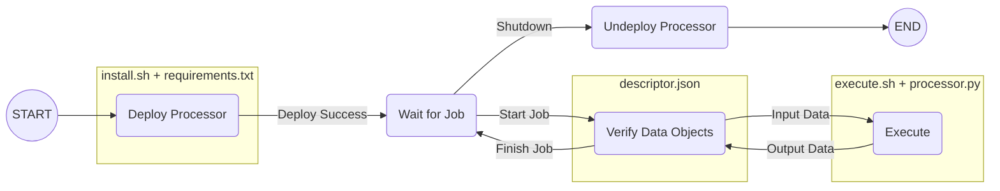

# Simulation-as-a-Service (SaaS) Middleware

> *This repository is part of the Cooling Singapore 2.0 project which ended in August 2024. 
The repository is deprecated and will no longer be maintained. Simulation-as-a-Service technology
will be further developed by the SEC Digital Twin Lab. For further information please contact 
contact-dtlab@sec.ethz.ch.*


The SaaS Middleware provides the infrastructure to facilitate deployment and operations
of a loosely-coupled federation of models.

## Prerequisites
- Python 3.10 (does not work with newer Python versions)
- Linux or MacOS Operating System (not tested with Windows)

## Install

Clone the repository:
```shell
git clone https://github.com/cooling-singapore/saas-middleware
```

Create and activate the virtual environment:
```shell
python3.10 -m venv venv-saas
source venv-saas/bin/activate
```

Install the SaaS Middleware:
```shell
pip install saas-middleware
```

Once done, you may deactivate the virtual environment - or keep it activated if you want
to starting using the SaaS Middleware:
```shell
deactivate
```

## Usage
The SaaS Middleware can be used via a Command Line Interface (CLI) with this command 
once it is installed:
```shell
saas-cli
```

The CLI can be used in a non-interactive manner by providing corresponding command line
arguments. In addition, commands also allow interactive use of the CLI in which case the 
user is prompted for input. The following sections explains how to use of the CLI for 
common use-cases.

### Create Identity
> *If you are using the SaaS Middleware for the first time, you need to create an identity.*

Identities are used across the SaaS system for authentication/authorisation purposes as well 
for managing ownership and access rights to data objects. An identity is required to operate 
SaaS node instances or to interact with remote instances.

To create an identity, the user would have to provide a name for the identity, a contact (i.e.,
email) and a password. In addition to a name and email, an identity is also associated with a 
set of keys for signing and encryption purposes, which are generated upon creation of the 
identity. The identity would then be assigned a unique ID and be stored together with the set 
of keys in the form of a JSON file called a keystore. The keystore can be referenced by the 
identity ID.

By default, the keystore will be created in a folder named `.keystore` in the home directory
(e.g. `$HOME\.keystore`), and can be changed by providing the `--keystore` flag.

Identities can be created interactively by following the prompts using:
```shell
saas-cli identity create

? Enter name: foo bar
? Enter email: foo.bar@email.com
? Enter password: ****
? Re-enter password: ****
New keystore created!
- Identity: foo bar/foo.bar@email.com/i6vmw1hffcsf5pg6dlc4ofxl1s95czqs6uuqg8mf9hz32qdei4b8gmwu4eivtm3t
- Signing Key: EC/secp384r1/384/466de4a0abd4275c5efeba80ef0e3ec7f65c3fa5849160d6b2ad79c1329bcedb
- Encryption Key: RSA/4096/42cd241bb8ac7dc1864350e9fc47cdb1833314dd35d01c46455ea681f552f165
```

The example above shows the identity created with ID `i6vmw1hffcsf5pg6dlc4ofxl1s95czqs6uuqg8mf9hz32qdei4b8gmwu4eivtm3t`.

Identities can also be created non-interactively by specifying the password as well as details
about the identity using command line parameters. For example:
```shell
saas-cli --keystore=$KEYSTORE_PATH --password 'password' identity create --name 'foo bar' --email 'foo.bar@email.com'
```

After creating identities, the user can list all the keystores found in the keystore path using:
```shell
saas-cli identity list

Found 1 keystores in '/home/foo.bar/.keystore':
NAME     EMAIL              KEYSTORE/IDENTITY ID
----     -----              --------------------
foo bar  foo.bar@email.com  i6vmw1hffcsf5pg6dlc4ofxl1s95czqs6uuqg8mf9hz32qdei4b8gmwu4eivtm3t
```

The `--keystore` flag can be provided to the command above if it is not found in the default path.

#### Credentials
The keystore can also be used to store and associate credentials with the identity. 
These credentials can be used for deploying processors and running jobs.
For example, GitHub for cloning from private repositories or SSH for executing remote commands.
More information about deploying processors and running jobs can be found in the sections below.

Credentials (SSH or GitHub) can be added by following the prompts using:
```shell
saas-cli identity credentials add ssh

# OR

saas-cli identity credentials add github
```

For a list of all commands concerning identities, use:
```shell
saas-cli identity --help
```

### Running a SaaS Node Instance
A SaaS Node instance provides services to store data objects and to execute simulation jobs.
These services are provided by the Data Object Repository (DOR) and Runtime Infrastructure (RTI)
modules, respectively. Depending on the requirements, nodes can be configured to act as 
storage-only nodes (by only starting the DOR service), execution-only nodes (by only starting 
the RTI service), or as full nodes (by starting DOR and RTI services). 

When starting a node, the user has to specify the datastore path where a node stores all its data,
and the ID of a keystore whose identity the node will use. By default, the datastore path will 
be in the home directory (e.g. `$HOME/.datastore`) and the keystore path to search for the ID in 
the home directory as well (e.g `$HOME/.keystore`). 

The user has to assign the address and port for the REST and P2P service for the node. 
These addresses are used for nodes in the network to communicate with each other. 
Make sure that the ports being assigned are open and not used by other processes. 
Additionally, new nodes will need to connect to a boot node in the network to retrieve 
information about other nodes in the network. 
The boot node will be referenced by its P2P address and can be any node in the network.
If the node that is the first node in the network, it can connect to itself. 

There are a number of options (and corresponding command line flags) that the user can specify:
- Retain RTI job history: instructs the RTI to keep the complete job history. This option is
useful for debugging and testing purposes.
- Bind service to all network addresses: Binds the REST and P2P services to any address of the 
machine i.e. `0.0.0.0`. This option is useful for Docker.
- Strict processor deployment: instructs the node to only allow the node owner identity to 
deploy/undeploy processors.
- Concurrent job processing: instructs the RTI to process all jobs in the queue concurrently.
- Purge inactive jobs: instructs the RTI to purge inactive jobs upon startup. This can be useful
to get rid of stale jobs.

Here is an example:
```shell
saas-cli service

? Enter path to datastore: /Users/foo_bar/.datastore
? Enter address for REST service: 127.0.0.1:5001
? Enter address for P2P service: 127.0.0.1:4001
? Enter address for boot node: 127.0.0.1:4001
? Select the type of service: Full node (i.e., DOR + RTI services)
? Retain RTI job history? No
? Bind service to all network addresses? No
? Strict processor deployment? Yes
? Concurrent job processing? Yes
? Purge inactive jobs? No
? Select the keystore: foo bar/foo.bar@email.com/i6vmw1hffcsf5pg6dlc4ofxl1s95czqs6uuqg8mf9hz32qdei4b8gmwu4eivtm3t
? Enter password: ****
INFO:     Started server process [19547]
INFO:     Waiting for application startup.
INFO:     Application startup complete.
INFO:     Uvicorn running on http://127.0.0.1:5001 (Press CTRL+C to quit)
```

The example above shows a node running with a REST service at address `127.0.0.1:5001`. This 
address will be used to interact with this node using the CLI. 

Running a service can also be done non-interactively, by providing the necessary command line
arguments. For a list of all arguments, use:
```shell
saas-cli service --help
```

### Adding and Removing a Data Object
One of the two core modules of a SaaS Node is the Data Object Repository (DOR). It stores data
objects and makes them available across the domain for jobs that are executed by a Runtime 
Infrastructure (RTI). The content of a data object can be virtually anything so as long as it
is a single file.

When adding a new data object to a DOR, the user needs to specify the data type and format of
the data object. In addition, the user may use optional flags to indicate if access to the data 
object should be restricted (`--restrict-access`) and if the data object content should be 
encrypted (`--encrypt-content`). If access is restricted, the owner needs to explicitly grant
permission to other identities before they can make use of the data objects. If encryption is 
used, the CLI will use keystore functionality to create a content key and encrypt the data 
object before uploading it to the DOR. 

If it is the first time an identity is interacting with the node, there will be an option to 
publish the identity to the node so that the node will recognise it. This allows a user to 
assign this new identity as a co-creator of the object (more information below).

Example:
```shell
saas-cli dor --address 127.0.0.1:5001 add --data-type 'JSONObject' --data-format 'json' data_object_a.json

? Select the keystore: foo bar/foo.bar@email.com/i6vmw1hffcsf5pg6dlc4ofxl1s95czqs6uuqg8mf9hz32qdei4b8gmwu4eivtm3t
? Enter password: ****
? Select data objects to be removed: ["a8db42a189d354da4d15b2bee36b9e2474dc79154155f291191b02a2550aafe7 C[JSONObject:json] ['name=data_object_a.json']"]
Deleting a8db42a189d354da4d15b2bee36b9e2474dc79154155f291191b02a2550aafe7...Done
(venv-saas) foo_bar@SEC-M10052 Desktop % saas-cli dor --address 127.0.0.1:5001 add --data-type 'JSONObject' --data-format 'json' data_object_a.json 
? Select the keystore: foo bar/foo.bar@email.com/i6vmw1hffcsf5pg6dlc4ofxl1s95czqs6uuqg8mf9hz32qdei4b8gmwu4eivtm3t
? Enter password: ****
? Select all identities that are co-creators of this data object: ['foo bar/foo.bar@email.com/i6vmw1hffcsf5pg6dlc4ofxl1s95czqs6uuqg8mf9hz32qdei4b8gmwu4eivtm3t']
Data object added: {
    "obj_id": "64648b0e29133292382a025574d174c89c402f40f046070d651c56ccb98ca075",
    "c_hash": "05ea03c4a3ef474e2276a2910f804ae49e759d1107946e8b50df38dc508abc27",
    "data_type": "JSONObject",
    "data_format": "json",
    "created": {
        "timestamp": 1726782752975,
        "creators_iid": [
            "i6vmw1hffcsf5pg6dlc4ofxl1s95czqs6uuqg8mf9hz32qdei4b8gmwu4eivtm3t"
        ]
    },
    "owner_iid": "i6vmw1hffcsf5pg6dlc4ofxl1s95czqs6uuqg8mf9hz32qdei4b8gmwu4eivtm3t",
    "access_restricted": false,
    "access": [
        "i6vmw1hffcsf5pg6dlc4ofxl1s95czqs6uuqg8mf9hz32qdei4b8gmwu4eivtm3t"
    ],
    "tags": {},
    "last_accessed": 1726782752975,
    "custodian": {
        "identity": {
            "id": "i6vmw1hffcsf5pg6dlc4ofxl1s95czqs6uuqg8mf9hz32qdei4b8gmwu4eivtm3t",
            "name": "foo bar",
            "email": "foo.bar@email.com",
            "s_public_key": "MHYwEAYHKoZIzj0CAQYFK4EEACIDYgAEW0r/ZwvqVhyX7IuJ8EEqGPdyJsXSgBvJaWvjOePCBctr/ZVzW84a/TbyDFJFqKjsaFKZBJfulyDHySxeAuWLH3KTZLxM+uqfMDOK9vDlmlRKXEpzSDi1p2GIiNbltpF8",
            "e_public_key": "MIICIjANBgkqhkiG9w0BAQEFAAOCAg8AMIICCgKCAgEAy4TZ67ljBPkXHB7SabJ79v+zIIrL8wY4lI4CTOukJmFVVGm8vx3V0zQIl8ktdvpx5NYTKlw0gel+1dN/uIwq6A4dSm2Nviq2FHoMgO3vlhOzhsCF2r36AdBCLCVscHEzJVzr0cEAv738+f+1Vu3msXlXc5aelChsUdURjghHhtZuNkuo4RtV62eSrF+hulwv+cWks7VM3tOcmqKQV+jWqaODz4jqmTUki480u2R5IKKsJbL+yjlfbJ/veO5rVj9DG9KCYCf4kXd5UAEyVf5q9xWU7QmKSS4OTi0gqnaF3p9InBIMrWXSLZVSDdyLlVHm40ZPP6ZjjUwxHnx6ulY4NXuLGBQ9z5i6AKr5CoijUDX4CYJREdSJ7mvmiYdq0ADuB/6JnlSZLgngFvcel/wslVUzL09jfN3sjoPYyEcwfbL1oDmHST4mwaxaw6OocTlZeq/ZgGoFryhCTtzLd5OytyWWEQ8+g83Tc3Ro2/bFUpiFQb8WuHMEDw+gT71Yq0LE9ePEVzuc4m2R7CTCmTAx16JwQMF0GpCPGa5FrSMp5vd1Wgiw11HUofL4ozIMAJGWdsC+qXVhLnjQckVLbppot9TluAwv7SwZZvI2eUma8b6kNwbaWM9mBiK4WKzHfXyS141HxC3fpcbIcY5CcCGmZmk67hPARAwXXSqtk1G4ySsCAwEAAQ==",
            "nonce": 1,
            "signature": "3065023100c6558bfc0e3f73d95872d88f52a96c69ecf5e3a7e9e94e613744a9606918e89278f1b41830e2f708f240f8ab2fca35eb0230783584afa24c9863ddcee9468ecb17df2c98198b801ecd4cbfb3c8e98643a65c9037844ebc42eda10420d0f4baeb5358",
            "last_seen": null
        },
        "last_seen": 1726782752985,
        "dor_service": true,
        "rti_service": true,
        "p2p_address": [
            "127.0.0.1",
            4001
        ],
        "rest_address": [
            "127.0.0.1",
            5001
        ],
        "retain_job_history": false,
        "strict_deployment": true,
        "job_concurrency": true
    },
    "content_encrypted": false,
    "license": {
        "by": false,
        "sa": false,
        "nc": false,
        "nd": false
    },
    "recipe": null
}
```
The example above shows the new data object `a8db42a189d354da4d15b2bee36b9e2474dc79154155f291191b02a2550aafe7` 
with an owner ID `i6vmw1hffcsf5pg6dlc4ofxl1s95czqs6uuqg8mf9hz32qdei4b8gmwu4eivtm3t` which belongs to the identity
used to add the data object.

Data objects can only be removed by their owner. Example:
```shell
saas-cli dor --address 127.0.0.1:5001 remove

Select the keystore: foo bar/foo.bar@email.com/i6vmw1hffcsf5pg6dlc4ofxl1s95czqs6uuqg8mf9hz32qdei4b8gmwu4eivtm3t
? Enter password: ****
? Select data objects to be removed: 
❯ ○ a8db42a189d354da4d15b2bee36b9e2474dc79154155f291191b02a2550aafe7 C[JSONObject:json] ['name=data_object_a.json']  
```

If the data object `a8db42a189d354da4d15b2bee36b9e2474dc79154155f291191b02a2550aafe7` would not be
owned by the identity used to run the CLI, the object would not be available for selection. If the 
object id used as command line argument, the DOR would deny to delete it if the user is not the
owner of the data object.

### Granting and Revoking Access to Data Objects 
If the access to a data object is restricted (see previous section), then only identities that
have been explicitly granted permission may use the data object. To grant access:
```shell
saas-cli dor --address 127.0.0.1:5001 access grant  

? Select the keystore: foo bar/foo.bar@email.com/i6vmw1hffcsf5pg6dlc4ofxl1s95czqs6uuqg8mf9hz32qdei4b8gmwu4eivtm3t
? Enter password: ****
? Select data objects: ["a8db42a189d354da4d15b2bee36b9e2474dc79154155f291191b02a2550aafe7 C[JSONObject:json] ['name=data_object_a.json']"]
? Select the identity who should be granted access: 
  foo bar/foo.bar@email.com/i6vmw1hffcsf5pg6dlc4ofxl1s95czqs6uuqg8mf9hz32qdei4b8gmwu4eivtm3t
❯ bar foo/bar.foo@elsewhere.com/53w6ls1e6ctzhg0pkpi3jfaqm4173qgr8auq4qg3nz1bvlq9qee9kl54ro27v8y8
```

Note that a DOR can only grant access to identities it knows about. If you have created a new
identity, then the network of SaaS nodes doesn't automatically know about this identity. You
can publish an identity to a node, using:
```shell
saas-cli identity publish
```

To revoke access:
```shell
saas-cli dor --address 127.0.0.1:5001 access revoke

? Select the keystore: foo bar/foo.bar@email.com/i6vmw1hffcsf5pg6dlc4ofxl1s95czqs6uuqg8mf9hz32qdei4b8gmwu4eivtm3t
? Enter password: ****
? Select data object: a8db42a189d354da4d15b2bee36b9e2474dc79154155f291191b02a2550aafe7 C[JSONObject:json] ['name=data_object_a.json']
? Select the identities whose access should be removed: 
  ○ foo bar/foo.bar@email.com/i6vmw1hffcsf5pg6dlc4ofxl1s95czqs6uuqg8mf9hz32qdei4b8gmwu4eivtm3t
❯ ○ bar foo/bar.foo@elsewhere.com/53w6ls1e6ctzhg0pkpi3jfaqm4173qgr8auq4qg3nz1bvlq9qee9kl54ro27v8y8
```

### Deploying and Undeploying Processors
The other core module of a SaaS Node is the Runtime Infrastructure (RTI). It executes 
computational jobs using processors that have been deployed on the node. Depending on the 
processor, a job will use some input data (provided by a DOR in form of data objects
or parameters in form of a json object) and produce some output data (as data objects that will
be stored on a DOR). Exactly what input is consumed and what output is produced is specified 
by the descriptor of the processor. See "Processor" for more information on this topic. 

Before a processor can be deployed, a Git Processor Pointer (GPP) in form of a data object 
needs to be added to a DOR in the same domain where the RTI can find it. Corresponding DOR 
functionality can be used for this purpose. The CLI tool allows the user to specify the 
repository and the commit id (default is the most recent commit id of the Main/Master branch).
It then automatically searches for processors inside the repository and presents a list to 
the user to choose from.

The following example shows how to interactively add a GPP:
```shell
saas-cli dor --address 127.0.0.1:5001 add-gpp      

? Select the keystore: foo bar/foo.bar@email.com/i6vmw1hffcsf5pg6dlc4ofxl1s95czqs6uuqg8mf9hz32qdei4b8gmwu4eivtm3t
? Enter password: ****
? Enter the URL of the Github repository: https://github.com/cooling-singapore/saas-middleware
? Analyse repository at https://github.com/cooling-singapore/saas-middleware to help with missing arguments? Yes
Cloning repository 'saas-middleware' to '/Users/foo_bar/.temp/saas-middleware'...Done
Determining default commit id...Done: 8654f3892e49c854dbe056560bfb02226e05a059
? Enter commit id: 8654f3892e49c854dbe056560bfb02226e05a059
Checkout commit id 8654f3892e49c854dbe056560bfb02226e05a059...Done
Searching for processor descriptors...Done: found 2 descriptors.
Analysing descriptor file '/Users/foo_bar/.temp/saas-middleware/examples/adapters/proc_example2/descriptor.json'...Done
Analysing descriptor file '/Users/foo_bar/.temp/saas-middleware/examples/adapters/proc_example/descriptor.json'...Done
? Select a processor: example-processor in examples/adapters/proc_example
Load processor descriptor at 'examples/adapters/proc_example'...Done
? Select the configuration profile: default
GPP Data object added: {
    "obj_id": "aa7875575e1ba1f9edeae67d5b04941c168d078106d9349a2184eed83f0355f2",
    "c_hash": "aa7875575e1ba1f9edeae67d5b04941c168d078106d9349a2184eed83f0355f2",
    "data_type": "GitProcessorPointer",
    "data_format": "json",
    "created": {
        "timestamp": 1726782405089,
        "creators_iid": [
            "i6vmw1hffcsf5pg6dlc4ofxl1s95czqs6uuqg8mf9hz32qdei4b8gmwu4eivtm3t"
        ]
    },
    "owner_iid": "i6vmw1hffcsf5pg6dlc4ofxl1s95czqs6uuqg8mf9hz32qdei4b8gmwu4eivtm3t",
    "access_restricted": false,
    "access": [
        "i6vmw1hffcsf5pg6dlc4ofxl1s95czqs6uuqg8mf9hz32qdei4b8gmwu4eivtm3t"
    ],
    "tags": {},
    "last_accessed": 1726782405089,
    "custodian": {
        "identity": {
            "id": "i6vmw1hffcsf5pg6dlc4ofxl1s95czqs6uuqg8mf9hz32qdei4b8gmwu4eivtm3t",
            "name": "foo bar",
            "email": "foo.bar@email.com",
            "s_public_key": "MHYwEAYHKoZIzj0CAQYFK4EEACIDYgAEW0r/ZwvqVhyX7IuJ8EEqGPdyJsXSgBvJaWvjOePCBctr/ZVzW84a/TbyDFJFqKjsaFKZBJfulyDHySxeAuWLH3KTZLxM+uqfMDOK9vDlmlRKXEpzSDi1p2GIiNbltpF8",
            "e_public_key": "MIICIjANBgkqhkiG9w0BAQEFAAOCAg8AMIICCgKCAgEAy4TZ67ljBPkXHB7SabJ79v+zIIrL8wY4lI4CTOukJmFVVGm8vx3V0zQIl8ktdvpx5NYTKlw0gel+1dN/uIwq6A4dSm2Nviq2FHoMgO3vlhOzhsCF2r36AdBCLCVscHEzJVzr0cEAv738+f+1Vu3msXlXc5aelChsUdURjghHhtZuNkuo4RtV62eSrF+hulwv+cWks7VM3tOcmqKQV+jWqaODz4jqmTUki480u2R5IKKsJbL+yjlfbJ/veO5rVj9DG9KCYCf4kXd5UAEyVf5q9xWU7QmKSS4OTi0gqnaF3p9InBIMrWXSLZVSDdyLlVHm40ZPP6ZjjUwxHnx6ulY4NXuLGBQ9z5i6AKr5CoijUDX4CYJREdSJ7mvmiYdq0ADuB/6JnlSZLgngFvcel/wslVUzL09jfN3sjoPYyEcwfbL1oDmHST4mwaxaw6OocTlZeq/ZgGoFryhCTtzLd5OytyWWEQ8+g83Tc3Ro2/bFUpiFQb8WuHMEDw+gT71Yq0LE9ePEVzuc4m2R7CTCmTAx16JwQMF0GpCPGa5FrSMp5vd1Wgiw11HUofL4ozIMAJGWdsC+qXVhLnjQckVLbppot9TluAwv7SwZZvI2eUma8b6kNwbaWM9mBiK4WKzHfXyS141HxC3fpcbIcY5CcCGmZmk67hPARAwXXSqtk1G4ySsCAwEAAQ==",
            "nonce": 1,
            "signature": "306602310092e11e27d9e2e821853bb8546d09c8956b921d092a5af4021b5fb29b8d3e7c3e0bd7f073f2ae6c7953a8741eac98fc1d023100b723e87793129f46ff9d4994007d04c9f7ad275cd5d710821ae5a9efc31bb3fff5cefbc2ab36caa9fb75a106017d0c9b",
            "last_seen": null
        },
        "last_seen": 1726782405092,
        "dor_service": true,
        "rti_service": true,
        "p2p_address": [
            "127.0.0.1",
            4001
        ],
        "rest_address": [
            "127.0.0.1",
            5001
        ],
        "retain_job_history": false,
        "strict_deployment": true,
        "job_concurrency": true
    },
    "gpp": {
        "source": "https://github.com/cooling-singapore/saas-middleware",
        "commit_id": "8654f3892e49c854dbe056560bfb02226e05a059",
        "proc_path": "examples/adapters/proc_example",
        "proc_config": "default",
        "proc_descriptor": {
            "name": "example-processor",
            "input": [
                {
                    "name": "a",
                    "data_type": "JSONObject",
                    "data_format": "json",
                    "data_schema": {
                        "type": "object",
                        "properties": {
                            "v": {
                                "type": "number"
                            }
                        },
                        "required": [
                            "v"
                        ]
                    }
                },
                {
                    "name": "b",
                    "data_type": "JSONObject",
                    "data_format": "json",
                    "data_schema": {
                        "type": "object",
                        "properties": {
                            "v": {
                                "type": "number"
                            }
                        },
                        "required": [
                            "v"
                        ]
                    }
                }
            ],
            "output": [
                {
                    "name": "c",
                    "data_type": "JSONObject",
                    "data_format": "json",
                    "data_schema": null
                }
            ],
            "configurations": [
                "default",
                "nscc"
            ]
        }
    }
}
```

Once the GPP data object is available in a DOR, the RTI can be instructed to deploy the 
processor on the node. The user can specify if the processor should be deployed locally
or on a remote machine. In the latter case, there needs to be a SSH profile available in
form of credentials attached to the identity that does the deployment.

Example:
```shell
saas-cli rti --address 127.0.0.1:5001 proc deploy


? Select the keystore: foo bar/foo.bar@email.com/i6vmw1hffcsf5pg6dlc4ofxl1s95czqs6uuqg8mf9hz32qdei4b8gmwu4eivtm3t
? Enter password: ****
? Select the processor you would like to deploy: aa7875575e1ba1f9edeae67d5b04941c168d078106d9349a2184eed83f0355f2 [example-processor] default:8654f3892e49c854db
e056560bfb02226e05a059
? Use an SSH profile for deployment? No
Deploying processor aa7875575e1ba1f9edeae67d5b04941c168d078106d9349a2184eed83f0355f2...Done
```

Undeployment works in the same fashion as deployment:
```shell
saas-cli rti --address 127.0.0.1:5001 proc undeploy

? Select the keystore: foo bar/foo.bar@email.com/i6vmw1hffcsf5pg6dlc4ofxl1s95czqs6uuqg8mf9hz32qdei4b8gmwu4eivtm3t
? Enter password: ****
? Select the processor: ['example-processor default:8654f3892e49c854dbe056560bfb02226e05a059']
Undeploying processor aa7875575e1ba1f9edeae67d5b04941c168d078106d9349a2184eed83f0355f2...Done
```

For a list of all arguments, use:
```shell
saas-cli rti proc --help
```

### Submit Job and Check Status
Once a processor is deployed, it can be used to perform computational jobs. For all items 
in the processor's input interface, a corresponding data object needs to be provided either
by-reference (i.e., using the id of a data object stored in a DOR) or by-value (i.e., by 
directly providing the value for the input item as `json` object). For all items in the 
processor's output interface, a job needs to specify the future owner of the data object once
it has been produced, whether it should have restricted access and whether it should be 
encrypted.

```shell
saas-cli rti --address 127.0.0.1:5001 job submit

? Select the keystore: foo bar/foo.bar@email.com/i6vmw1hffcsf5pg6dlc4ofxl1s95czqs6uuqg8mf9hz32qdei4b8gmwu4eivtm3t
? Enter password: ****
? Select the processor for the job: aa7875575e1ba1f9edeae67d5b04941c168d078106d9349a2184eed83f0355f2: [example-processor] default:8654f3892e49c854dbe056560bfb02
226e05a059
Processor descriptor: {
    "name": "example-processor",
    "input": [
        {
            "name": "a",
            "data_type": "JSONObject",
            "data_format": "json",
            "data_schema": {
                "type": "object",
                "properties": {
                    "v": {
                        "type": "number"
                    }
                },
                "required": [
                    "v"
                ]
            }
        },
        {
            "name": "b",
            "data_type": "JSONObject",
            "data_format": "json",
            "data_schema": {
                "type": "object",
                "properties": {
                    "v": {
                        "type": "number"
                    }
                },
                "required": [
                    "v"
                ]
            }
        }
    ],
    "output": [
        {
            "name": "c",
            "data_type": "JSONObject",
            "data_format": "json",
            "data_schema": null
        }
    ],
    "configurations": [
        "default",
        "nscc"
    ]
}
? How to set input 'a' (JSONObject:json)? by-reference
? Select the data object to be used for input 'a': 64648b0e29133292382a025574d174c89c402f40f046070d651c56ccb98ca075 C[JSONObject:json] ['name=data_object_a.json']
? How to set input 'b' (JSONObject:json)? by-reference
? Select the data object to be used for input 'b': 64648b0e29133292382a025574d174c89c402f40f046070d651c56ccb98ca075 C[JSONObject:json] ['name=data_object_a.json']
? Select the owner for the output data objects: foo bar/foo.bar@email.com/i6vmw1hffcsf5pg6dlc4ofxl1s95czqs6uuqg8mf9hz32qdei4b8gmwu4eivtm3t
? Select the destination node for the output data objects: foo bar/i6vmw1hffcsf5pg6dlc4ofxl1s95czqs6uuqg8mf9hz32qdei4b8gmwu4eivtm3t at ('127.0.0.1', 5001)/('127.0.0.1', 4001)
? Should access to output data objects be restricted? No
Job submitted: job-id=GJGxQAp3
```

If the job has been successfully submitted, a job id will be returned. This id can be used
to check on the status of the job:
```shell
saas-cli rti --address 127.0.0.1:5001 job status GJGxQAp3

? Select the keystore: foo bar/foo.bar@email.com/i6vmw1hffcsf5pg6dlc4ofxl1s95czqs6uuqg8mf9hz32qdei4b8gmwu4eivtm3t
? Enter password: ****
Status: {
    "state": "successful",
    "progress": 100,
    "output": {
        "c": {
            "obj_id": "3655b328f119fd832b4a1ed6438ea49dea720c111175f6fb4898a02d75eb38cc",
            "c_hash": "f190dded3f6b7faeb49a80d3a558b881a0decb356b1bf392ce9202110fbe58a0",
            "data_type": "JSONObject",
            "data_format": "json",
            "created": {
                "timestamp": 1726782804941,
                "creators_iid": [
                    "i6vmw1hffcsf5pg6dlc4ofxl1s95czqs6uuqg8mf9hz32qdei4b8gmwu4eivtm3t"
                ]
            },
            "owner_iid": "i6vmw1hffcsf5pg6dlc4ofxl1s95czqs6uuqg8mf9hz32qdei4b8gmwu4eivtm3t",
            "access_restricted": false,
            "access": [
                "i6vmw1hffcsf5pg6dlc4ofxl1s95czqs6uuqg8mf9hz32qdei4b8gmwu4eivtm3t"
            ],
            "tags": {
                "name": "c",
                "job_id": "GJGxQAp3"
            },
            "last_accessed": 1726782805003,
            "custodian": {
                "identity": {
                    "id": "i6vmw1hffcsf5pg6dlc4ofxl1s95czqs6uuqg8mf9hz32qdei4b8gmwu4eivtm3t",
                    "name": "foo bar",
                    "email": "foo.bar@email.com",
                    "s_public_key": "MHYwEAYHKoZIzj0CAQYFK4EEACIDYgAEW0r/ZwvqVhyX7IuJ8EEqGPdyJsXSgBvJaWvjOePCBctr/ZVzW84a/TbyDFJFqKjsaFKZBJfulyDHySxeAuWLH3KTZLxM+uqfMDOK9vDlmlRKXEpzSDi1p2GIiNbltpF8",
                    "e_public_key": "MIICIjANBgkqhkiG9w0BAQEFAAOCAg8AMIICCgKCAgEAy4TZ67ljBPkXHB7SabJ79v+zIIrL8wY4lI4CTOukJmFVVGm8vx3V0zQIl8ktdvpx5NYTKlw0gel+1dN/uIwq6A4dSm2Nviq2FHoMgO3vlhOzhsCF2r36AdBCLCVscHEzJVzr0cEAv738+f+1Vu3msXlXc5aelChsUdURjghHhtZuNkuo4RtV62eSrF+hulwv+cWks7VM3tOcmqKQV+jWqaODz4jqmTUki480u2R5IKKsJbL+yjlfbJ/veO5rVj9DG9KCYCf4kXd5UAEyVf5q9xWU7QmKSS4OTi0gqnaF3p9InBIMrWXSLZVSDdyLlVHm40ZPP6ZjjUwxHnx6ulY4NXuLGBQ9z5i6AKr5CoijUDX4CYJREdSJ7mvmiYdq0ADuB/6JnlSZLgngFvcel/wslVUzL09jfN3sjoPYyEcwfbL1oDmHST4mwaxaw6OocTlZeq/ZgGoFryhCTtzLd5OytyWWEQ8+g83Tc3Ro2/bFUpiFQb8WuHMEDw+gT71Yq0LE9ePEVzuc4m2R7CTCmTAx16JwQMF0GpCPGa5FrSMp5vd1Wgiw11HUofL4ozIMAJGWdsC+qXVhLnjQckVLbppot9TluAwv7SwZZvI2eUma8b6kNwbaWM9mBiK4WKzHfXyS141HxC3fpcbIcY5CcCGmZmk67hPARAwXXSqtk1G4ySsCAwEAAQ==",
                    "nonce": 1,
                    "signature": "3065023100c6558bfc0e3f73d95872d88f52a96c69ecf5e3a7e9e94e613744a9606918e89278f1b41830e2f708f240f8ab2fca35eb0230783584afa24c9863ddcee9468ecb17df2c98198b801ecd4cbfb3c8e98643a65c9037844ebc42eda10420d0f4baeb5358",
                    "last_seen": null
                },
                "last_seen": 1726782805005,
                "dor_service": true,
                "rti_service": true,
                "p2p_address": [
                    "127.0.0.1",
                    4001
                ],
                "rest_address": [
                    "127.0.0.1",
                    5001
                ],
                "retain_job_history": false,
                "strict_deployment": true,
                "job_concurrency": true
            },
            "content_encrypted": false,
            "license": {
                "by": false,
                "sa": false,
                "nc": false,
                "nd": false
            },
            "recipe": {
                "processor": {
                    "source": "https://github.com/cooling-singapore/saas-middleware",
                    "commit_id": "8654f3892e49c854dbe056560bfb02226e05a059",
                    "proc_path": "examples/adapters/proc_example",
                    "proc_config": "default",
                    "proc_descriptor": {
                        "name": "example-processor",
                        "input": [
                            {
                                "name": "a",
                                "data_type": "JSONObject",
                                "data_format": "json",
                                "data_schema": {
                                    "type": "object",
                                    "properties": {
                                        "v": {
                                            "type": "number"
                                        }
                                    },
                                    "required": [
                                        "v"
                                    ]
                                }
                            },
                            {
                                "name": "b",
                                "data_type": "JSONObject",
                                "data_format": "json",
                                "data_schema": {
                                    "type": "object",
                                    "properties": {
                                        "v": {
                                            "type": "number"
                                        }
                                    },
                                    "required": [
                                        "v"
                                    ]
                                }
                            }
                        ],
                        "output": [
                            {
                                "name": "c",
                                "data_type": "JSONObject",
                                "data_format": "json",
                                "data_schema": null
                            }
                        ],
                        "configurations": [
                            "default",
                            "nscc"
                        ]
                    }
                },
                "consumes": {
                    "a": {
                        "c_hash": "05ea03c4a3ef474e2276a2910f804ae49e759d1107946e8b50df38dc508abc27",
                        "data_type": "JSONObject",
                        "data_format": "json",
                        "content": null
                    },
                    "b": {
                        "c_hash": "05ea03c4a3ef474e2276a2910f804ae49e759d1107946e8b50df38dc508abc27",
                        "data_type": "JSONObject",
                        "data_format": "json",
                        "content": null
                    }
                },
                "product": {
                    "c_hash": "f190dded3f6b7faeb49a80d3a558b881a0decb356b1bf392ce9202110fbe58a0",
                    "data_type": "JSONObject",
                    "data_format": "json",
                    "content": null
                },
                "name": "c"
            }
        }
    },
    "notes": {
        "reconnect_info": {
            "paths": {
                "local_wd": "/Users/foo_bar/.datastore/jobs/GJGxQAp3",
                "wd": "/Users/foo_bar/.datastore/jobs/GJGxQAp3"
            },
            "pid": "22893",
            "pid_paths": {
                "local_wd_path": "/Users/foo_bar/.datastore/jobs/GJGxQAp3",
                "local_stdout": "/Users/foo_bar/.datastore/jobs/GJGxQAp3/execute_sh.stdout",
                "local_stderr": "/Users/foo_bar/.datastore/jobs/GJGxQAp3/execute_sh.stderr",
                "local_pid": "/Users/foo_bar/.datastore/jobs/GJGxQAp3/execute_sh.pid",
                "local_exitcode": "/Users/foo_bar/.datastore/jobs/GJGxQAp3/execute_sh.exitcode",
                "local_script": "/Users/foo_bar/.datastore/jobs/GJGxQAp3/execute_sh.sh",
                "wd_path": "/Users/foo_bar/.datastore/jobs/GJGxQAp3",
                "stdout": "/Users/foo_bar/.datastore/jobs/GJGxQAp3/execute_sh.stdout",
                "stderr": "/Users/foo_bar/.datastore/jobs/GJGxQAp3/execute_sh.stderr",
                "pid": "/Users/foo_bar/.datastore/jobs/GJGxQAp3/execute_sh.pid",
                "script": "/Users/foo_bar/.datastore/jobs/GJGxQAp3/execute_sh.sh",
                "exitcode": "/Users/foo_bar/.datastore/jobs/GJGxQAp3/execute_sh.exitcode"
            }
        }
    },
    "job": {
        "id": "GJGxQAp3",
        "task": {
            "proc_id": "aa7875575e1ba1f9edeae67d5b04941c168d078106d9349a2184eed83f0355f2",
            "user_iid": "i6vmw1hffcsf5pg6dlc4ofxl1s95czqs6uuqg8mf9hz32qdei4b8gmwu4eivtm3t",
            "input": [
                {
                    "name": "a",
                    "type": "reference",
                    "obj_id": "64648b0e29133292382a025574d174c89c402f40f046070d651c56ccb98ca075",
                    "user_signature": null,
                    "c_hash": null
                },
                {
                    "name": "b",
                    "type": "reference",
                    "obj_id": "64648b0e29133292382a025574d174c89c402f40f046070d651c56ccb98ca075",
                    "user_signature": null,
                    "c_hash": null
                }
            ],
            "output": [
                {
                    "name": "c",
                    "owner_iid": "i6vmw1hffcsf5pg6dlc4ofxl1s95czqs6uuqg8mf9hz32qdei4b8gmwu4eivtm3t",
                    "restricted_access": false,
                    "content_encrypted": false,
                    "target_node_iid": "i6vmw1hffcsf5pg6dlc4ofxl1s95czqs6uuqg8mf9hz32qdei4b8gmwu4eivtm3t"
                }
            ],
            "name": null,
            "description": null
        },
        "retain": false,
        "custodian": {
            "identity": {
                "id": "i6vmw1hffcsf5pg6dlc4ofxl1s95czqs6uuqg8mf9hz32qdei4b8gmwu4eivtm3t",
                "name": "foo bar",
                "email": "foo.bar@email.com",
                "s_public_key": "MHYwEAYHKoZIzj0CAQYFK4EEACIDYgAEW0r/ZwvqVhyX7IuJ8EEqGPdyJsXSgBvJaWvjOePCBctr/ZVzW84a/TbyDFJFqKjsaFKZBJfulyDHySxeAuWLH3KTZLxM+uqfMDOK9vDlmlRKXEpzSDi1p2GIiNbltpF8",
                "e_public_key": "MIICIjANBgkqhkiG9w0BAQEFAAOCAg8AMIICCgKCAgEAy4TZ67ljBPkXHB7SabJ79v+zIIrL8wY4lI4CTOukJmFVVGm8vx3V0zQIl8ktdvpx5NYTKlw0gel+1dN/uIwq6A4dSm2Nviq2FHoMgO3vlhOzhsCF2r36AdBCLCVscHEzJVzr0cEAv738+f+1Vu3msXlXc5aelChsUdURjghHhtZuNkuo4RtV62eSrF+hulwv+cWks7VM3tOcmqKQV+jWqaODz4jqmTUki480u2R5IKKsJbL+yjlfbJ/veO5rVj9DG9KCYCf4kXd5UAEyVf5q9xWU7QmKSS4OTi0gqnaF3p9InBIMrWXSLZVSDdyLlVHm40ZPP6ZjjUwxHnx6ulY4NXuLGBQ9z5i6AKr5CoijUDX4CYJREdSJ7mvmiYdq0ADuB/6JnlSZLgngFvcel/wslVUzL09jfN3sjoPYyEcwfbL1oDmHST4mwaxaw6OocTlZeq/ZgGoFryhCTtzLd5OytyWWEQ8+g83Tc3Ro2/bFUpiFQb8WuHMEDw+gT71Yq0LE9ePEVzuc4m2R7CTCmTAx16JwQMF0GpCPGa5FrSMp5vd1Wgiw11HUofL4ozIMAJGWdsC+qXVhLnjQckVLbppot9TluAwv7SwZZvI2eUma8b6kNwbaWM9mBiK4WKzHfXyS141HxC3fpcbIcY5CcCGmZmk67hPARAwXXSqtk1G4ySsCAwEAAQ==",
                "nonce": 1,
                "signature": "3065023100c6558bfc0e3f73d95872d88f52a96c69ecf5e3a7e9e94e613744a9606918e89278f1b41830e2f708f240f8ab2fca35eb0230783584afa24c9863ddcee9468ecb17df2c98198b801ecd4cbfb3c8e98643a65c9037844ebc42eda10420d0f4baeb5358",
                "last_seen": null
            },
            "last_seen": 1726782798609,
            "dor_service": true,
            "rti_service": true,
            "p2p_address": [
                "127.0.0.1",
                4001
            ],
            "rest_address": [
                "127.0.0.1",
                5001
            ],
            "retain_job_history": false,
            "strict_deployment": true,
            "job_concurrency": true
        },
        "proc_name": "example-processor",
        "t_submitted": 1726782798609
    },
    "reconnect": null,
    "errors": [],
    "message": {
        "severity": "info",
        "content": "...and we are done!"
    }
}
```

For a list of all arguments, use:
```shell
saas-cli rti job --help
```


## Processors, API and SDK
A processor provides a wrapper interface around an application (e.g. program or script) with a 
clearly defined specification of inputs/outputs and instructions on how to install/execute it.
They can be then deployed using the RTI and users would be able to execute computational jobs. 

### Directory Structure
A valid processor should follow a similar folder structure and contain these types of files 
(with exact file names and in the same directory) as shown below:

```
saas_processor/
├── descriptor.json
├── execute.sh
├── install.sh
├── processor.py
└── requirements.txt
```

The diagram below shows the lifecycle of a processor and the stages where each of these files 
are used:


#### Install Script (`install.sh`) + Python Dependencies (`requirements.txt`)
The Install script specifies how to set up the proper environment for the processor during the 
deployment stage. This can include installing software, compiling binaries and downloading 
external dependencies. It runs every time an instance of the processor is deployed. Example of 
Install Script:
```bash
#!/bin/bash

if [ "$1" == "default" ]; then
    echo "Run default configuration"
  python3 -m pip install -r ./requirements.txt
    exit 0

elif [ "$1" == "nscc" ]; then
    echo "Run nscc configuration"
  python3 -m pip install -r ./requirements.txt
    exit 0

else
    exit 1
fi

```

When the script is executed, an argument (value of chosen `configuration`) is passed to the 
script which specifies how the processor should be deployed. From the example above, the 
processor accepts either `default` or `nscc` as valid configurations, and runs the respective 
code based on the given argument. 

This is also where python dependencies for the processor can be installed using 
the `requirements.txt` file. This file follows the [format](https://pip.pypa.io/en/stable/reference/requirements-file-format/#requirements-file-format) that pip uses. 
Note that the RTI does not use this file automatically so it has to be added manually into 
the `install.sh` file by the user. If no python dependencies are required, this file can be 
omitted.

#### Processor Descriptor (`descriptor.json`)
A processor descriptor specifies the name, input/output interfaces and configurations of a 
processor. It is in the form of a JSON file and is structured as follows:
```json
{
  "name": ...,
  "input": [
    ...
  ],
  "output": [
    ...
  ],
  "configurations": [
    ...
  ]
}
```

The input/output interfaces (`input` and `output`) are lists of items that specify the input
data consumed and output data produced by the processor, respectively. This information is used 
before and after job execution to verify that the correct data objects are submitted and 
created respectively.

Structure of Input/Output Item:
```json
{
  "name": ...,
  "data_type": ...,
  "data_format": ...
}
```
An item has a name, a data type and data format. `data_type` provides the context of how the 
data is used (e.g. `AHProfile` is for anthropogenic heat profile). `data_format` is how the 
data is formatted/encoded (e.g. `csv`).

The `configurations` property is a list of user defined strings that describes the runtime 
configurations supported by this processor. They are mainly used in the `install.sh` and 
`execute.sh` scripts, and affects how the processor will be deployed and executed. 

Example of a processor descriptor:
```json
{
  "name": "test-proc",
  "input": [
    {
      "name": "a",
      "data_type": "JSONObject",
      "data_format": "json"
    },
    {
      "name": "b",
      "data_type": "JSONObject",
      "data_format": "json"
    }
  ],
  "output": [
    {
      "name": "c",
      "data_type": "JSONObject",
      "data_format": "json"
    }
  ],
  "configurations": [
    "default", 
    "nscc"
  ]
}
```

#### Execute Script (`execute.sh`) + Python Script (`processor.py`) 
The execution script specifies how the processor should run a given job during the 
execution stage. It runs every time the processor executes a job. Example of an execution 
script:
```bash
#!/bin/bash 

if [ "$1" == "default" ]; then
    echo "Run processor.py with default configuration on $2"
    python3 processor.py $2

elif [ "$1" == "nscc" ]; then
    echo "Run processor.py with nscc configuration on $2"
    python3 processor.py $2

else
    exit 1
fi
```

When the script is executed, it is passed two arguments. First, the configuration of the 
processor (same value passed to the `install.sh` script) and second, the path to the working 
directory. The working directory is where the inputs files the job needs will be found and 
where output files of the job should be written to. From the example above, the path is passed 
to as an argument to the `processor.py` during execution.

The `processor.py` is where most of the execution logic is written. Note that since the 
`execute.sh` script is a bash file that the RTI runs during execution, it could actually be 
used to run anything (e.g. run a compiled binary file, launch an external program, running 
simple bash commands, etc), and not use the `processor.py` file at all. It is mostly used as 
a convention for creating SaaS processors using Python. As long as output files are created 
into the working directory (as provided by the second argument of the `execute.sh` script) 
and the required triggers are provided (explained in the following section), the job should 
finish successfully.

### Processor functions
During the execution stage, the status of the job must be communicated with the RTI so that 
the RTI can decide if the job has completed successfully. This is done in the form of 
__triggers__ which are lines sent to the system output (`stdout`) in the form 
`trigger:{type}:{value}`. RTI would monitor the system output of the execution script for 
such triggers and react according to the type of trigger received.

Currently, the RTI accepts two kinds of triggers that can be sent during execution of the 
job, `progress` and `output`. The `progress` trigger is mainly used for monitoring purposes 
for the user as it only shows the progress of the execution script in the form of percentage 
number (e.g. `80`). The RTI does not do anything when receiving this trigger, other than 
forwarding its contents to its output. Example of `progress` trigger:
```
trigger:progress:80
```

The `output` trigger is used to track the creation of output files of the processors. 
This trigger is required to be present for each output file that an processor would produce 
(as stated in the processor descriptor) for a job to be considered successful. Example of 
`output` trigger:
```
trigger:output:c
```

These triggers can be found as helper functions in the module `saas.sdk.processor` and can be 
used in the `processor.py`.


